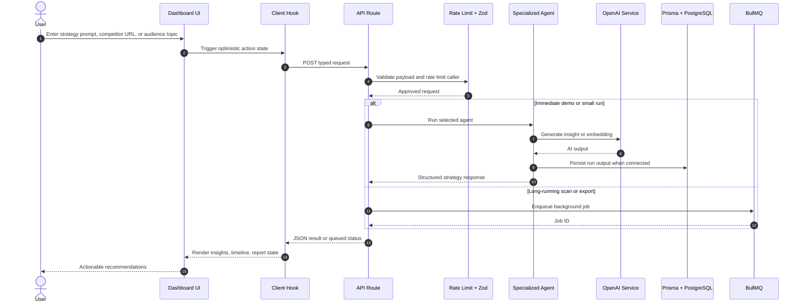
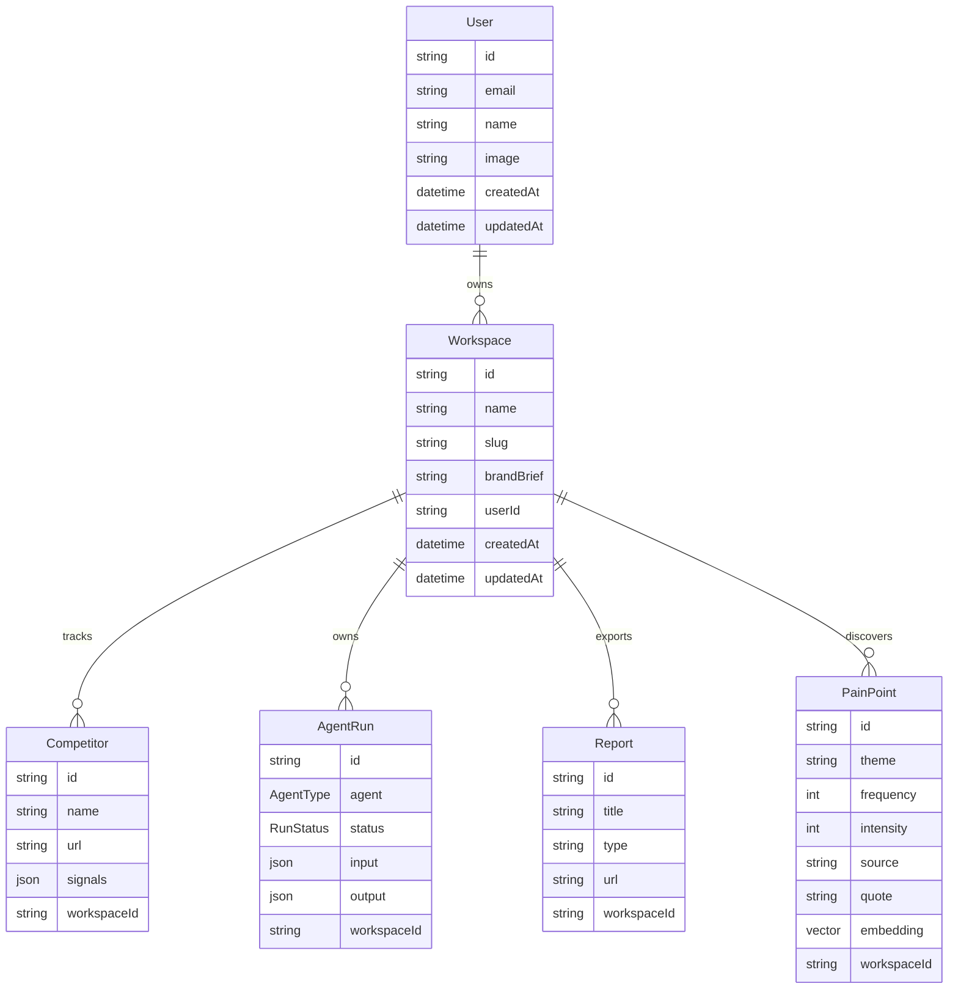
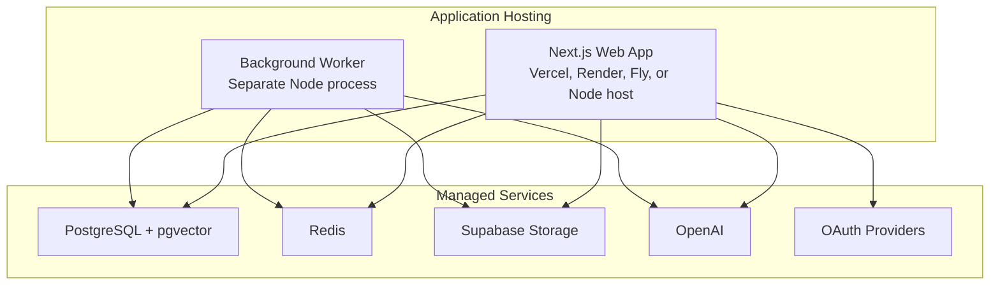

# AdPeriscope System Design

This document maps the AdPeriscope architecture from user-facing dashboards down to AI agents, background jobs, data stores, and external integrations.

## High-Level Architecture

```mermaid
flowchart TB
  user["Users<br/>Businesses, startups, agencies, creators"]
  browser["Web Browser<br/>Responsive dashboard UI"]

  subgraph app["Next.js 15 Application"]
    marketing["Marketing Pages<br/>Landing, pricing"]
    authPages["Auth Pages<br/>Sign in, sign up"]
    onboarding["Onboarding Flow<br/>Brand, competitors, audience"]
    workspaces["My Workspaces<br/>List and launch workspaces"]
    dashboards["Dashboard UX<br/>Command center, SEO, competitors, audience, personas, planner, assistant, settings"]
    ui["Reusable UI System<br/>Neobrutal cards, buttons, inputs, skeletons, charts, layout shell"]
    store["Zustand Store<br/>Workspace state, dark mode"]
    hooks["Client Hooks<br/>Agent run hooks, optimistic UI flows"]
    apiClient["API Client Layer<br/>Typed fetch abstraction"]
  end

  subgraph api["Next.js API Routes"]
    rateLimit["Rate Limiting<br/>Per-request guard"]
    validation["Zod Validation<br/>Typed request contracts"]
    chatApi["/api/ai/chat"]
    agentApi["/api/agents/run"]
    seoApi["/api/seo"]
    competitorApi["/api/competitors"]
    painApi["/api/pain-points"]
    personaApi["/api/personas"]
    contentApi["/api/content-plan"]
    reportApi["/api/reports/export"]
    workspaceApi["/api/workspaces"]
    authApi["/api/auth/[...nextauth]"]
  end

  subgraph domain["Domain Services"]
    orchestrator["AI Orchestrator<br/>Runs multi-agent strategy briefs"]
    prompts["Prompt Templates<br/>Agent-specific instructions"]
    aiService["OpenAI Service Layer<br/>Chat completions and embeddings"]
    scraping["Public Source Adapters<br/>Reddit, YouTube, RSS, websites, Firecrawl, Playwright"]
    painEngine["Pain-Point Engine<br/>Extraction, clustering, intensity ranking"]
    storage["Storage Service<br/>Supabase report uploads"]
    logging["Logging<br/>Structured JSON logs"]
  end

  subgraph agents["Specialized AI Agents"]
    seoAgent["SEO Agent<br/>Keywords, SERP intent, semantic groups, gaps"]
    competitorAgent["Competitor Agent<br/>Cadence, headlines, offers, viral topics"]
    audienceAgent["Audience Agent<br/>Reddit and YouTube pain points"]
    personaAgent["Brand Persona Agent<br/>Archetypes, voice, positioning"]
    contentAgent["Content Strategy Agent<br/>Calendars, hooks, CTAs, repurposing"]
  end

  subgraph jobs["Background Jobs"]
    queues["BullMQ Queues<br/>agent-runs, report-exports"]
    worker["Worker Process<br/>jobs/worker.ts"]
    schedules["Scheduled Automation<br/>Future recurring scans and content generation"]
  end

  subgraph data["Data Layer"]
    prisma["Prisma ORM<br/>Typed database access"]
    postgres["PostgreSQL<br/>Users, workspaces, competitors, agent runs, reports"]
    pgvector["pgvector-ready embeddings<br/>PainPoint.embedding"]
    supabase["Supabase Storage<br/>PDF reports and uploaded assets"]
    redis["Redis<br/>BullMQ queue backend"]
  end

  subgraph external["External Integrations"]
    openai["OpenAI APIs<br/>Text generation, embeddings"]
    oauth["OAuth Providers<br/>Google, GitHub"]
    reddit["Reddit API or scraping"]
    youtube["YouTube comments"]
    trends["Google Trends"]
    rss["News RSS feeds"]
    competitorWeb["Public competitor websites"]
    chrome["Future Chrome Extension<br/>Capture active page signals"]
    social["Future Social APIs<br/>Scheduler and publishing"]
  end

  user --> browser
  browser --> marketing
  browser --> authPages
  authPages --> workspaces
  browser --> onboarding
  browser --> workspaces
  browser --> dashboards
  workspaces --> dashboards
  dashboards --> ui
  dashboards --> store
  dashboards --> hooks
  hooks --> apiClient
  apiClient --> api

  api --> rateLimit
  api --> validation
  authPages --> authApi
  authApi --> oauth

  chatApi --> aiService
  agentApi --> orchestrator
  seoApi --> seoAgent
  competitorApi --> competitorAgent
  painApi --> scraping
  painApi --> painEngine
  personaApi --> personaAgent
  contentApi --> contentAgent
  reportApi --> storage
  workspaceApi --> prisma

  orchestrator --> seoAgent
  orchestrator --> competitorAgent
  orchestrator --> audienceAgent
  orchestrator --> contentAgent
  agents --> prompts
  agents --> aiService
  aiService --> openai

  scraping --> reddit
  scraping --> youtube
  scraping --> rss
  scraping --> competitorWeb
  scraping --> trends
  painEngine --> aiService
  painEngine --> prisma

  api --> queues
  queues --> redis
  queues --> worker
  schedules --> queues
  worker --> agents
  worker --> prisma

  prisma --> postgres
  postgres --> pgvector
  storage --> supabase
  reportApi --> queues

  chrome -.future.-> competitorApi
  social -.future.-> queues
```

## Request Flow

## Pain-Point Engine Flow

```mermaid
flowchart LR
  input["User selects audience topic<br/>subreddits, keywords, YouTube videos"]
  collect["Collect public discussions<br/>Reddit, YouTube, RSS, web pages"]
  normalize["Normalize records<br/>source, title, body, URL, engagement"]
  embed["Generate embeddings<br/>text-embedding-3-small"]
  cluster["Cluster related complaints<br/>semantic similarity"]
  score["Rank pain points<br/>frequency + emotional intensity"]
  store["Persist to Postgres<br/>PainPoint rows + pgvector"]
  surface["Dashboard output<br/>themes, quotes, sentiment, content angles"]

  input --> collect --> normalize --> embed --> cluster --> score --> store --> surface
```

## Agent Responsibilities

| Agent | Inputs | Main Work | Outputs |
| --- | --- | --- | --- |
| SEO Agent | Keywords, site context, competitors | Keyword research, intent classification, semantic grouping, content gap analysis | SEO score, long-tail ideas, ranking recommendations |
| Competitor Agent | Competitor URLs, public pages, headlines | Track cadence, extract patterns, compare topics and offers | Competitor cards, viral patterns, content gaps |
| Audience Agent | Subreddits, videos, queries, comments | Mine complaints, questions, objections, and sentiment | Pain-point clusters, emotional intensity, exact language |
| Brand Persona Agent | Brand brief, offer, audience notes | Generate archetypes, tone, voice, positioning | Personas, communication style, messaging angles |
| Content Strategy Agent | SEO gaps, personas, pain points, channel goals | Build calendars, hooks, titles, CTAs, platform strategies | Weekly/monthly plans, social posts, blog outlines |

## Data Model Overview

## Deployment View

## Key Production Concerns

- Authentication: NextAuth OAuth routes are scaffolded for Google and GitHub.
- Authorization: Workspace reads and writes should be scoped to `Workspace.userId`.
- Reliability: Long-running agent scans should go through BullMQ workers rather than blocking API routes.
- Observability: `lib/logger.ts` emits structured JSON logs; production should add traces and job metrics.
- Rate limiting: API routes include a simple in-memory limiter; production should replace it with Redis-backed limits.
- Storage: Generated reports flow through Supabase Storage; local demo mode returns a mock report path.
- RAG readiness: The Prisma schema includes a pgvector-ready embedding field for pain-point/source retrieval.
- Extensibility: Future Chrome extension and social scheduler integrations can post into the same API and queue layers.
